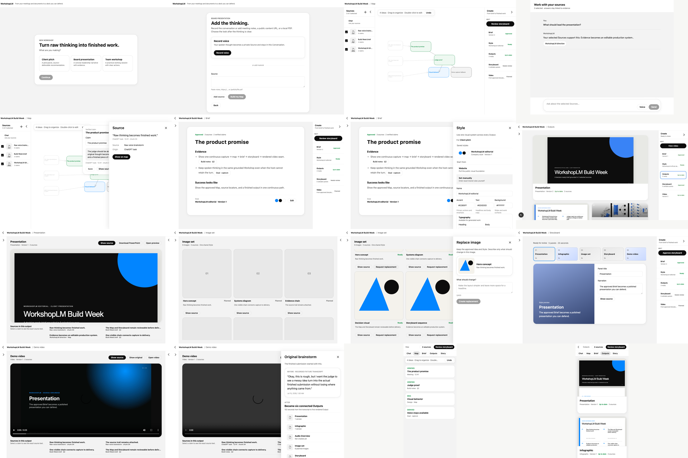

# WorkshopLM current UI gallery

Sixteen current screens show the professional Capture → Shape → Deliver path in the simplified ChatGPT/Codex-style workbench. The discarded tabbed MVP is no longer included.



## Journey

| # | Screen | What it proves |
| --- | --- | --- |
| 01 | [Start](01-start.png) | One clear professional outcome starts the Workshop. |
| 02 | [Add thinking](02-add-thinking.png) | Voice, notes, URLs, and local files enter through one capture surface. |
| 03 | [Grounded Map](03-grounded-map.png) | Sources become editable, linked claims on the semantic whiteboard. |
| 04 | [Grounded Chat](04-grounded-chat.png) | Text or voice questions stay scoped to selected Sources. |
| 05 | [Source evidence](05-source-evidence.png) | `Show source` reveals the exact supporting excerpt and locator. |
| 06 | [Approved Brief](06-approved-brief.png) | The first sign-off turns the current Map into the executable Brief. |
| 07 | [Company Style](07-company-style.png) | Website or manual brand rules stay reviewable before production. |
| 08 | [Current Outputs](08-current-outputs.png) | The provider-backed gallery shows only the current deliverables; history moves into focused objects. |
| 09 | [Presentation](09-presentation.png) | The hero deliverable retains its source trail and editable export. |
| 10 | [Image plan](10-image-set.png) | Grounded visual jobs remain reviewable before generation. |
| 11 | [Replace image](11-replace-image.png) | A professional directs one revision without editing model prompts. |
| 12 | [Storyboard](12-storyboard.png) | Panels remain editable before the second and final sign-off. |
| 13 | [Narrated Video](13-narrated-video.png) | Only the approved current Storyboard reaches the local renderer. |
| 14 | [Original reveal](14-original-reveal.png) | Finished work traces back to the thought that started it. |
| 15 | [Mobile Map](15-mobile-map.png) | The grounded Map remains legible at 390×844. |
| 16 | [Mobile Outputs](16-mobile-outputs.png) | Current deliverables remain usable at 390×844. |

## Evidence boundary

Screens 01–07 and 09–16 come from the strict production-route visual suite using a sanitized deterministic fixture; screen 10 deliberately shows the pre-generation plan. Screen 08 comes from an isolated copy of the inspected provider-backed Workshop and shows the real current output family. Provider provenance is recorded separately in `artifacts/live/provider-run.json`; the gallery does not claim that fixture pixels are provider results.

Rebuild the directory, manifest, contact sheet, and shareable ZIP with:

```bash
pnpm ui:gallery:build
```

The generated `manifest.json` records every source file, dimension, and SHA-256. The root `outputs/workshoplm-current-ui.zip` contains this README, all sixteen screens, the manifest, and the contact sheet.
