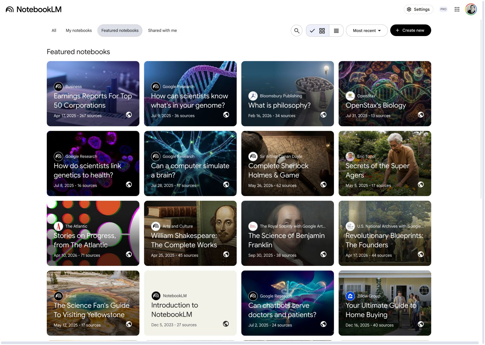
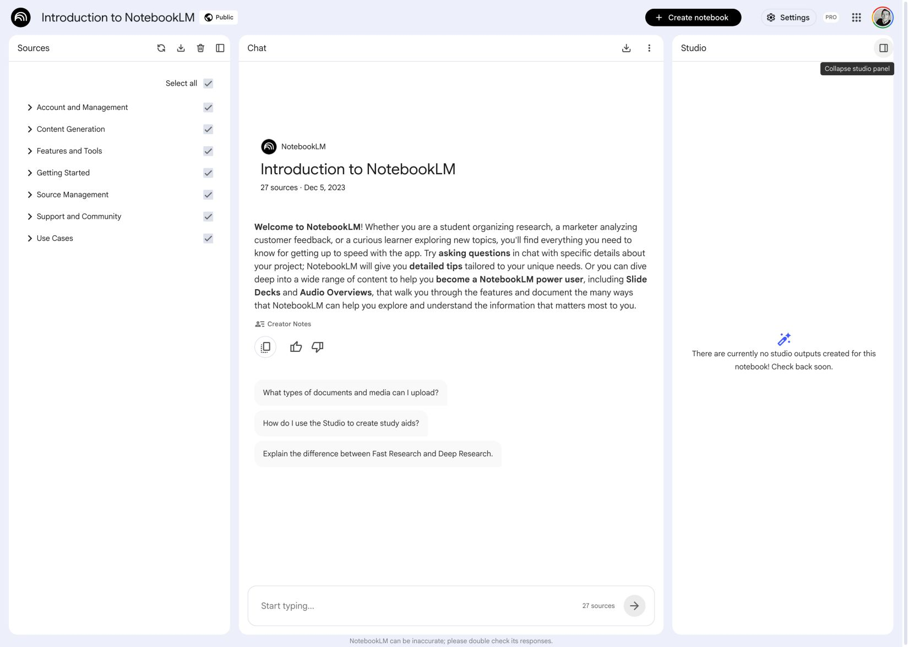
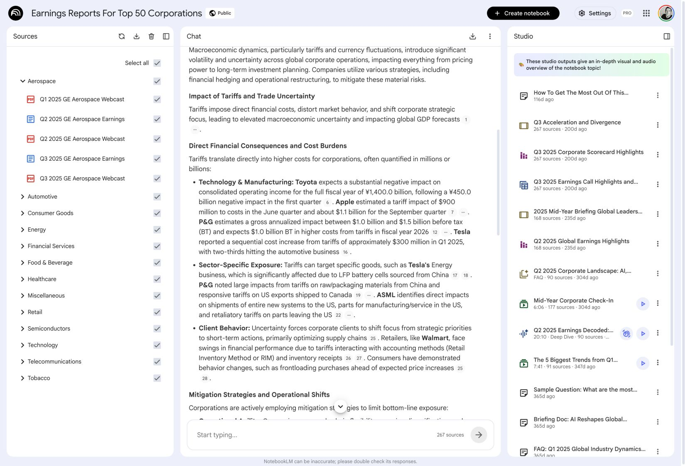
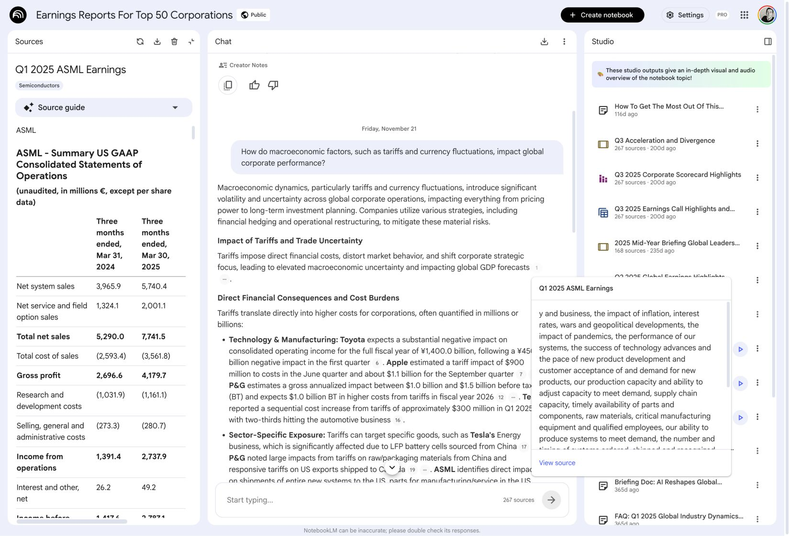
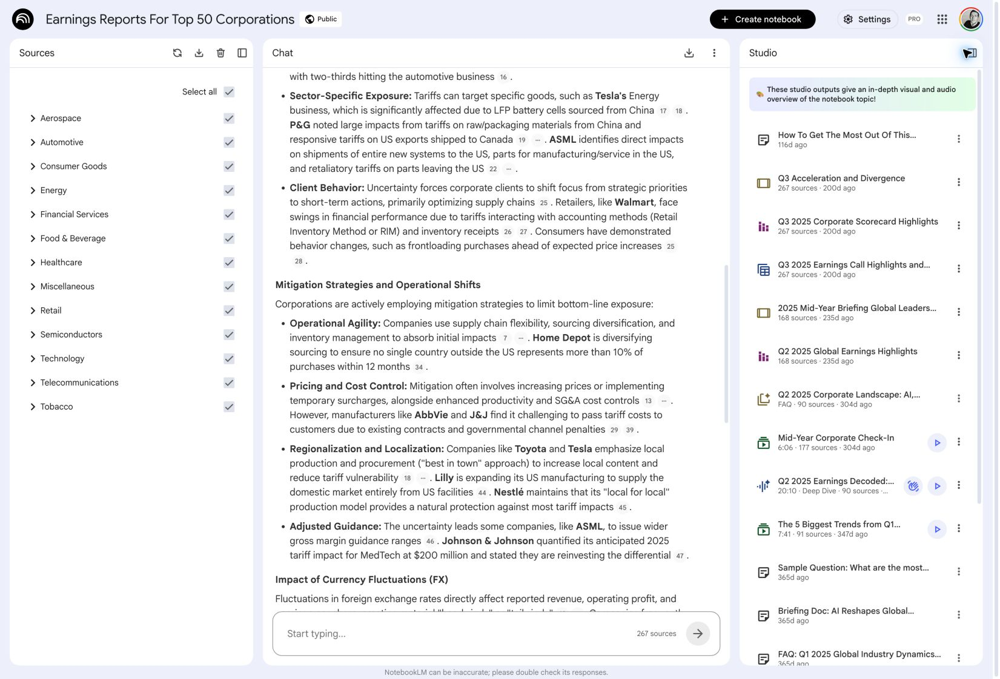
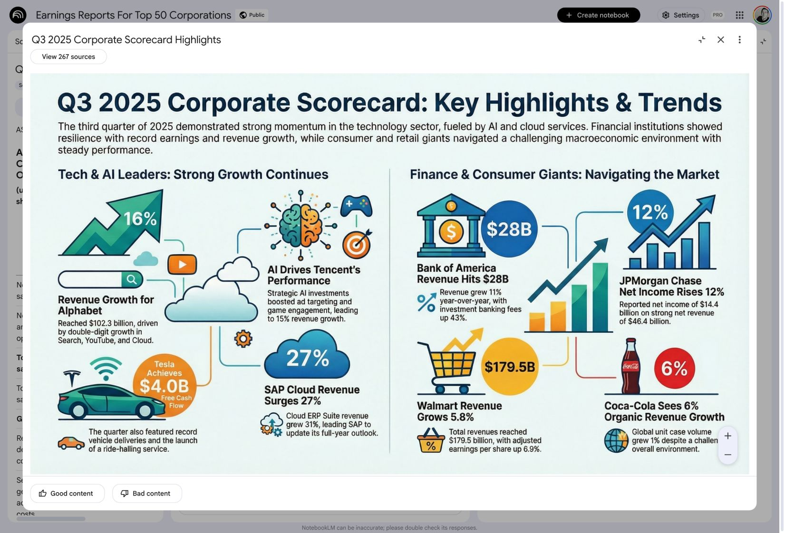

# NotebookLM live user-flow map

Observed: 2026-07-13 in the signed-in Chrome product, using only public featured notebooks.

No notebook was created, copied, edited, or shared during this inspection. Screenshots use public NotebookLM examples rather than the user's private notebook library.

## Product principle for WorkshopLM

> We are not reinventing the Notebook wheel. We are making it grow up and go to work.

WorkshopLM should preserve NotebookLM's learned mental model:

1. A durable container users return to.
2. Sources remain visible and scopeable.
3. Conversation is the primary way to understand and direct the work.
4. Studio holds durable generated outputs.

WorkshopLM extends that model with the missing professional control layer: Realtime capture, an editable semantic Map, an approved brief, exact brand/style systems, coherent batch generation, storyboard approval, dependency state, and editable deliverables.

## Observed flow

### 1. Library → choose a notebook

The homepage is a clear library, not a generic chatbot landing page.

Visible mechanics:

- `All`, `My notebooks`, `Featured notebooks`, and `Shared with me` filters;
- search;
- grid/list view;
- recency sort;
- one prominent `Create new` action;
- cards with title, visual identity, date, source count, and public state.

WorkshopLM translation:

- the library is **Workshops**;
- each card shows title, intent/style, collaborator state, source count, output count, last activity, and whether anything is stale;
- `New Workshop` is the primary action.



### 2. Notebook → stable three-panel shell

Opening a notebook preserves one stable workspace:

- **Sources** on the left;
- **Chat** in the center;
- **Studio** on the right.

Both side panels collapse without taking the user to a different product surface. The composer stays anchored at the bottom of Chat and shows the number of active sources.

WorkshopLM translation:

- **Sources** remains the left panel;
- the center switches between **Conversation** and **Map** without leaving the Workshop;
- **Studio** remains the right panel;
- the same Realtime/text composer follows the user between Conversation and Map.



### 3. Scope sources before asking or generating

NotebookLM makes source selection a direct, low-friction control. Sources can be grouped, expanded, and individually checked. The active-source count is visible in the composer.

WorkshopLM should preserve this exactly, then add:

- source permission and freshness state;
- claim/evidence coverage;
- meeting speaker and timestamp locators;
- a visible warning when an output depends on a deselected or stale source.



### 4. Chat → source-grounded answer

The center begins with a creator summary and suggested questions. Chat responses use small inline numbered citations rather than breaking reading flow with large reference blocks.

Clicking a citation does two things at once:

1. the left Sources panel becomes the selected source viewer;
2. an excerpt popover appears next to the cited claim, with a route to the full source.

This is a strong pattern to keep. WorkshopLM should extend it so the same trace works from Map nodes, brief sections, slide blocks, infographic claims, storyboard panels, and narration lines.



### 5. Studio → durable output history

Studio is not a blank generator. It is a history of output objects. Each row communicates its type through an icon and may show title, duration, format, active source count, age, play, interactive mode, and overflow actions.

Observed public examples included notes/briefing docs, slide-like outputs, infographics, tables, FAQs, audio overviews, videos, and mind maps.

WorkshopLM should preserve the durable output history and add:

- status: `Draft`, `Generating`, `Needs review`, `Approved`, `Stale`, or `Failed`;
- exact evidence, brief, style, and model versions;
- open-in-editor rather than view-only results;
- batch relationships so a deck, image set, storyboard, and video visibly share one Visual DNA run.



### 6. Output → focused viewer with source context

A Studio output opens in a focused overlay. The title, source count, feedback, zoom, close, and overflow controls remain visible while the artifact gets most of the screen.

WorkshopLM should use the same focused-view pattern but make professional outputs editable. The inspector should expose source trace, style tokens, generation version, approval, and regenerate-this-block controls without turning the app into a general-purpose design tool.



## Recommended WorkshopLM information architecture

```text
Workshops library
└── Workshop
    ├── Sources
    │   ├── groups and connectors
    │   ├── active-source selection
    │   └── source / citation viewer
    ├── Center workspace
    │   ├── Conversation
    │   └── Map
    └── Studio
        ├── output types
        ├── output history and status
        └── focused editor / viewer
```

The user does not move through a long wizard. They remain inside one Workshop and shift attention between sources, thinking, and finished work.

## What to copy, extend, and avoid

| Decision | WorkshopLM direction |
| --- | --- |
| Durable notebook container | Copy as **Workshop** |
| Sources / Chat / Studio spatial model | Copy, with center **Conversation / Map** switch |
| Source checkboxes and source count | Copy |
| Suggested questions and persistent composer | Copy; add Realtime voice |
| Inline citations and adjacent source preview | Copy and propagate through every output |
| Durable Studio output history | Copy; add versions, state, and editability |
| Immediate opaque final generation | Replace with Map/brief and storyboard approval |
| Inconsistent visual generations | Replace with DESIGN.md, Intent Profile, and Visual DNA |
| View-only artifact modal | Extend into focused professional editor/inspector |
| Large general-purpose design canvas | Avoid for MVP |

## MVP implication

The hero demo should not spend time teaching judges a novel navigation model. It should look immediately legible to anyone who has seen NotebookLM:

1. Open the **WorkshopLM Build Week Demo** Workshop.
2. Show the raw voice source and active research sources on the left.
3. Continue the conversation in the center, then switch the center to Map.
4. Approve the Map as the brief.
5. Show website-derived `DESIGN.md` and Intent Profile.
6. Generate outputs into Studio on the right.
7. Open the storyboard, change one panel, approve it, and render the final video.
8. Reveal that the demo itself came from this Workshop.
