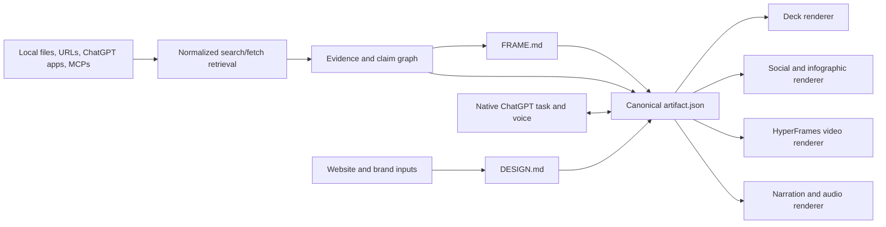

# OpenAI-native architecture

Checked: 2026-07-13

## Product model

The system should have one canonical project model and several renderers. Chat, voice, deck generation, image generation, and video generation must not each invent their own version of the truth.



## Approved OpenAI API and model map

The user explicitly requested text generation, RAG, Realtime voice, text-to-speech, and image generation. Current official OpenAI documentation supports the following implementation boundaries:

| Capability | API and model | WorkshopLM responsibility | Non-negotiable guardrail |
| --- | --- | --- | --- |
| Workshop reasoning and structured operations | Responses API with operation-level GPT-5.6 routing (`sol`, `terra`, `luna`) | source synthesis, claim extraction, graph operations, `FRAME.md`, asset plans, storyboard structures, propagation previews, and model-based evaluations | Route quality-critical reasoning to Sol, balanced structured work to Terra, and repeatable high-volume work to Luna; promote changes only after recorded quality, latency, and cost evidence. |
| RAG and citations | Local MCP `search`/`fetch`, SQLite FTS5/BM25, exact retrieval, optional semantic/File Search adapters | normalize local and connected-app sources, retrieve inspectable evidence, and preserve claim→chunk→source citations | A factual claim cannot become `verified` without a durable locator; remote adapters must normalize into the same evidence contract. |
| Conversation and voice | Responses API plus Realtime API inside WorkshopLM's in-app browser Conversation | stream grounded text answers, handle speech-to-speech turns and interruption, and execute the same typed local Workshop tools while durable state remains in SQLite | The browser receives only server-minted ephemeral Realtime credentials; the standard API key remains server-only. The installed classic ChatGPT app exposes no unified local-plugin surface, so Work parity and native task synchronization are not claimed. |
| Narration and Audio Overview | Audio Speech API with `gpt-4o-mini-tts` | render approved Storyboard voiceover in bounded scene segments and a separately grounded, reviewed Audio Overview; default to the high-quality `marin` voice unless demo testing favors another built-in voice | Disclose clearly that the voice is AI-generated. Store model, voice, instructions, version, duration, file hash, and exact source coverage with every audio artifact. |
| Coherent image batches | Image API with `gpt-image-2` | generate explicit batches from the locked Visual DNA and approved references; edit/regenerate individual outliers | Batch output is not proof of coherence. Evaluate outputs and selectively regenerate failures. The current model processes reference images at high fidelity automatically. |
| Conversational image revision | Responses API with GPT-5.6 routing and the `image_generation` tool | multi-turn edits when the user refines a selected image conversationally | Start with Terra for bounded revisions and escalate to Sol only when quality evaluation requires it; the image tool manages its own GPT Image model selection. |

Use configurable model aliases in environment-backed server configuration rather than scattering model strings through the application. Record the requested model and returned model/snapshot metadata with every generation. Tests use deterministic adapters and fixtures rather than spending API credits.

## Package integration boundary

`packages/ai` owns the OpenAI SDK and exposes small application-facing operations:

- `createGroundedResponse`
- `extractWorkshopGraph`
- `renderNarrationSegment`
- `generateImageBatch`
- `editImageConversationally`
- `evaluateImageCoherence`

`packages/host` owns Codex app-server account/task synchronization. `createRealtimeClientSecret` exists in `packages/ai` only if the Spike A fallback is activated.

React components and production renderers must not call the OpenAI SDK directly. They submit typed commands through the web API or worker and receive versioned domain results.

## Source grounding

### Recommended components

- **Responses API** as the main orchestration surface.
- **Standard plugin `search` and `fetch` tools** over normalized local and connected-app evidence.
- **SQLite FTS5/BM25 and exact search** as the deterministic core retrieval implementation.
- **File Search/vector stores or semantic vectors** only as optional adapters if live retrieval evidence justifies them.
- **Web search** when the user explicitly asks to extend the evidence base beyond supplied sources.
- **Existing ChatGPT apps/MCPs** for sources such as Granola, Drive, and other enabled work apps.
- Structured outputs for claim extraction, artifact plans, and revision operations.

### RAG implementation contract

Each Workshop owns a local normalized corpus. Local parsers and connected source apps produce `Source` and `EvidenceChunk` records with stable IDs, content hashes, permission state, and page/section/time/native locators. Standard MCP `search` returns ranked summaries; `fetch` returns the exact chunk/source content needed for inspection.

Grounded GPT-5.6 calls receive an explicit evidence bundle containing chunk IDs and locators. Returned factual claims must reference those chunk IDs or remain `unverified`. Optional hosted File Search must implement the same adapter and never replace WorkshopLM's canonical evidence records.

### Evidence states

Each material claim should have one of four states:

- `verified`: directly supported by selected evidence;
- `derived`: calculated or reasonably inferred from evidence, with method visible;
- `creative`: messaging or interpretation that is not a factual source claim;
- `unverified`: requires confirmation before publication.

Every artifact component should reference one or more claim IDs. Citations are therefore not painted onto the final slide; they are part of the underlying data model.

### Minimal source record

```json
{
  "id": "src_01",
  "title": "Meeting transcript",
  "origin": "granola",
  "captured_at": "2026-07-13T15:00:00Z",
  "content_hash": "...",
  "permissions": "workspace",
  "status": "indexed"
}
```

### Minimal claim record

```json
{
  "id": "claim_17",
  "text": "Customer onboarding time fell by 32%.",
  "state": "verified",
  "evidence": [{"source_id": "src_01", "locator": "00:18:42-00:19:06"}],
  "approved": true
}
```

## ChatGPT conversation and voice

### Verified — official

The installed Codex app-server protocol supports ChatGPT account state/login and task operations. The unified ChatGPT application is therefore the primary Conversation surface. OpenAI's Realtime API remains a proven low-latency fallback when a browser-owned voice capture is actually required.

### Recommended interaction

- The native ChatGPT task supports typing/voice and invokes WorkshopLM plugin tools.
- The in-app browser contains no duplicate composer.
- The assistant can cite sources verbally and expose the citation card visually.
- During generation, the user can interrupt: “Use the second source, not the blog post.”
- Tool actions that alter approved claims or publishable assets require a visible confirmation step.

Native ChatGPT voice is the fastest way to direct the visual Workshop without building a second conversation product.

### Host session contract

1. A server-side adapter connects to the local Codex app-server control surface.
2. `account/read` exposes safe account display state; WorkshopLM does not receive or store raw ChatGPT tokens.
3. The plugin links one ChatGPT task to one Workshop and persists attributable turns idempotently.
4. Plugin tools emit typed Workshop commands; model-authored arguments still pass command validation and approval rules.
5. A live spike determines whether native voice-originated turns have sufficient durable representation.
6. Only if they do not, the browser receives a server-minted ephemeral secret and exposes a narrow `gpt-realtime-2.1` capture fallback.

## Images, audio, and video

- **GPT Image 2** should generate and edit key imagery through the direct Image API, with the current `DESIGN.md`, Visual DNA manifest, reference ingredients, and scene specification included in the operation.
- The Responses image-generation tool supports conversational, multi-turn refinement but does not replace the direct batch adapter.
- **`gpt-4o-mini-tts`** renders narration only from approved storyboard text. Each panel is a separate recoverable audio job before final assembly.
- **HyperFrames** should render videos and motion presentations from the canonical scene model. Deterministic rendering is important for timing, repeatability, and cross-asset consistency.
- Generated images must store their prompt, source/claim context, design version, and parent scene ID.
- Generated speech must include a visible AI-voice disclosure in the playback/export surface and submission credits.

## Canonical files

- `SOURCES.json`: source metadata, permissions, hashes, and retrieval state.
- `CLAIMS.json`: supported, derived, creative, and unverified statements.
- `FRAME.md`: audience, objective, narrative, approved claims, CTA, and output constraints.
- `DESIGN.md`: reusable visual and motion system.
- `artifact.json`: sections, scenes, components, claim references, and renderer settings.

Markdown is the inspectable human contract; JSON is the executable contract. They should be generated together and versioned.

## Revision model

A revision is a typed operation, not an opaque prompt response:

```json
{
  "operation": "replace_claim",
  "from": "claim_17",
  "to": "claim_24",
  "targets": ["deck", "video", "linkedin_carousel"],
  "requires_approval": true
}
```

The UI should preview affected outputs before applying a cross-asset change.

## Privacy and demo safety

- Use sanitized sample meeting data in the public demo.
- Connect real accounts only when necessary and never expose connector tokens or unrelated workspace data.
- Record source permissions and prevent a public export from silently including a private citation.
- Keep an audit trail of generations, approvals, and propagated changes.
