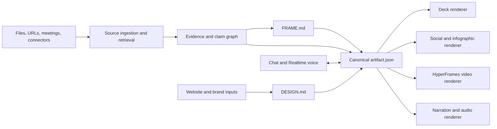

# OpenAI-native architecture

Checked: 2026-07-13

## Product model

The system should have one canonical project model and several renderers. Chat, voice, deck generation, image generation, and video generation must not each invent their own version of the truth.



## Approved OpenAI API and model map

The user explicitly requested text generation, RAG, Realtime voice, text-to-speech, and image generation. Current official OpenAI documentation supports the following implementation boundaries:

| Capability | API and model | WorkshopLM responsibility | Non-negotiable guardrail |
| --- | --- | --- | --- |
| Workshop reasoning and structured operations | Responses API with `gpt-5.6` | source synthesis, claim extraction, graph operations, `FRAME.md`, asset plans, storyboard structures, propagation previews, and model-based evaluations | Require structured schemas for executable outputs; never parse free-form prose into domain state ad hoc. |
| RAG and citations | Files API, project vector store, and Responses `file_search` tool | index project material, retrieve relevant evidence, retain file citations, and expose retrieved chunks for inspection | Request `include: ["file_search_call.results"]`; persist source locators and never treat an AI conversation as independent evidence. |
| Live conversation | Realtime API / Agents SDK with `gpt-realtime-2.1` over WebRTC | low-latency speech-to-speech capture, interruption, transcript events, and spatially aware tools | Mint ephemeral client secrets on the server through `/v1/realtime/client_secrets`; standard API keys never reach the browser. Bind a privacy-preserving safety identifier when a stable user identity exists. |
| Narration | Audio Speech API with `gpt-4o-mini-tts` | render approved storyboard voiceover in bounded scene segments; default to the high-quality `marin` voice unless demo testing favors another built-in voice | Disclose clearly that the voice is AI-generated. Store model, voice, instructions, and storyboard-panel version with every audio artifact. |
| Coherent image batches | Image API with `gpt-image-2` | generate explicit batches from the locked Visual DNA and approved references; edit/regenerate individual outliers | Batch output is not proof of coherence. Evaluate outputs and selectively regenerate failures. The current model processes reference images at high fidelity automatically. |
| Conversational image revision | Responses API with `gpt-5.6` and the `image_generation` tool | multi-turn edits when the user refines a selected image conversationally | Use this path for iterative edits, not as the only batch-production mechanism; the tool manages its own GPT Image model selection. |

Use configurable model aliases in environment-backed server configuration rather than scattering model strings through the application. Record the requested model and returned model/snapshot metadata with every generation. Tests use deterministic adapters and fixtures rather than spending API credits.

## Package integration boundary

`packages/ai` owns the OpenAI SDK and exposes small application-facing operations:

- `createGroundedResponse`
- `extractWorkshopGraph`
- `createRealtimeClientSecret`
- `renderNarrationSegment`
- `generateImageBatch`
- `editImageConversationally`
- `evaluateImageCoherence`

React components and production renderers must not call the OpenAI SDK directly. They submit typed commands through the web API or worker and receive versioned domain results.

## Source grounding

### Recommended OpenAI components

- **Responses API** as the main orchestration surface.
- **File Search and vector stores** for hosted retrieval over uploaded project material.
- **Web search** when the user explicitly asks to extend the evidence base beyond supplied sources.
- **Remote MCP/connectors** for sources such as Granola and other enabled work apps.
- Structured outputs for claim extraction, artifact plans, and revision operations.

### RAG implementation contract

Each Workshop owns a vector store ID. Ingestion uploads the sanitized source representation through the Files API, attaches it to the vector store, waits for indexing to complete, and records both OpenAI file IDs and WorkshopLM source IDs.

Grounded Responses calls:

- use `gpt-5.6`;
- expose the project vector store through the `file_search` tool;
- limit or filter results only when the product has enough evidence to justify the constraint;
- request `file_search_call.results` so retrieval quality is inspectable;
- convert `file_citation` annotations into durable claim-evidence edges.

File Search is the retrieval layer, not the canonical evidence store. WorkshopLM still retains source metadata, permissions, hashes, locators, claim approvals, and artifact dependencies in its own database.

### Evidence states

Each material claim should have one of four states:

- `verified`: directly supported by selected evidence;
- `derived`: calculated or reasonably inferred from evidence, with method visible;
- `creative`: messaging or interpretation that is not a factual source claim;
- `unverified`: requires confirmation before publication.

Every artifact component should reference one or more claim IDs. Citations are therefore not painted onto the final slide; they are part of the underlying data model.

### Minimal source record

```json
{
  "id": "src_01",
  "title": "Meeting transcript",
  "origin": "granola",
  "captured_at": "2026-07-13T15:00:00Z",
  "content_hash": "...",
  "permissions": "workspace",
  "status": "indexed"
}
```

### Minimal claim record

```json
{
  "id": "claim_17",
  "text": "Customer onboarding time fell by 32%.",
  "state": "verified",
  "evidence": [{"source_id": "src_01", "locator": "00:18:42-00:19:06"}],
  "approved": true
}
```

## Realtime chat and voice

### Verified — official

OpenAI's Realtime API supports low-latency speech-to-speech interaction. WebRTC is the recommended connection type for browser clients; WebSocket is appropriate for server-side connections. The API can also use tools during a live session.

### Recommended interaction

- One composer supports typing, attachments, and push-to-talk/live voice.
- Voice and text share the same conversation and project state.
- The assistant can cite sources verbally and expose the citation card visually.
- During generation, the user can interrupt: “Use the second source, not the blog post.”
- Tool actions that alter approved claims or publishable assets require a visible confirmation step.

Realtime voice is not a podcast gimmick here. It is the fastest way to direct a complex creative workspace while looking at the evidence and preview.

### Browser session contract

1. The web client requests a short-lived Realtime client secret from a WorkshopLM server route.
2. The server authenticates to OpenAI with the standard API key and creates a `gpt-realtime-2.1` session secret.
3. The browser connects over WebRTC through `RealtimeSession`.
4. Realtime tools emit typed project commands; they do not mutate database state directly from model-authored arguments.
5. Server-side command validation, authorization, version checks, and approval requirements run before mutation.
6. Transcript events are persisted as `TranscriptSegment` records and linked to any resulting graph operation.

The UI must expose idle, connecting, listening, thinking, speaking, interrupted, and failed states. Losing the live connection must not lose transcript segments already acknowledged by the server.

## Images, audio, and video

- **GPT Image 2** should generate and edit key imagery through the direct Image API, with the current `DESIGN.md`, Visual DNA manifest, reference ingredients, and scene specification included in the operation.
- The Responses image-generation tool supports conversational, multi-turn refinement but does not replace the direct batch adapter.
- **`gpt-4o-mini-tts`** renders narration only from approved storyboard text. Each panel is a separate recoverable audio job before final assembly.
- **HyperFrames** should render videos and motion presentations from the canonical scene model. Deterministic rendering is important for timing, repeatability, and cross-asset consistency.
- Generated images must store their prompt, source/claim context, design version, and parent scene ID.
- Generated speech must include a visible AI-voice disclosure in the playback/export surface and submission credits.

## Canonical files

- `SOURCES.json`: source metadata, permissions, hashes, and retrieval state.
- `CLAIMS.json`: supported, derived, creative, and unverified statements.
- `FRAME.md`: audience, objective, narrative, approved claims, CTA, and output constraints.
- `DESIGN.md`: reusable visual and motion system.
- `artifact.json`: sections, scenes, components, claim references, and renderer settings.

Markdown is the inspectable human contract; JSON is the executable contract. They should be generated together and versioned.

## Revision model

A revision is a typed operation, not an opaque prompt response:

```json
{
  "operation": "replace_claim",
  "from": "claim_17",
  "to": "claim_24",
  "targets": ["deck", "video", "linkedin_carousel"],
  "requires_approval": true
}
```

The UI should preview affected outputs before applying a cross-asset change.

## Privacy and demo safety

- Use sanitized sample meeting data in the public demo.
- Connect real accounts only when necessary and never expose connector tokens or unrelated workspace data.
- Record source permissions and prevent a public export from silently including a private citation.
- Keep an audit trail of generations, approvals, and propagated changes.
